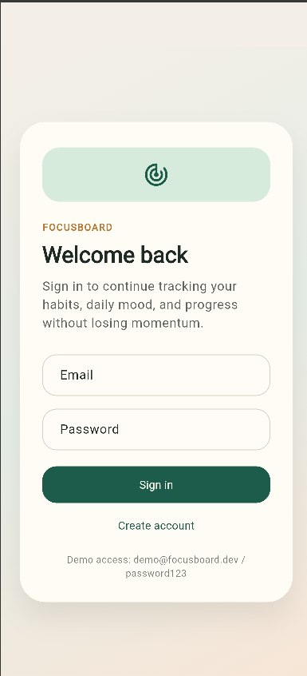
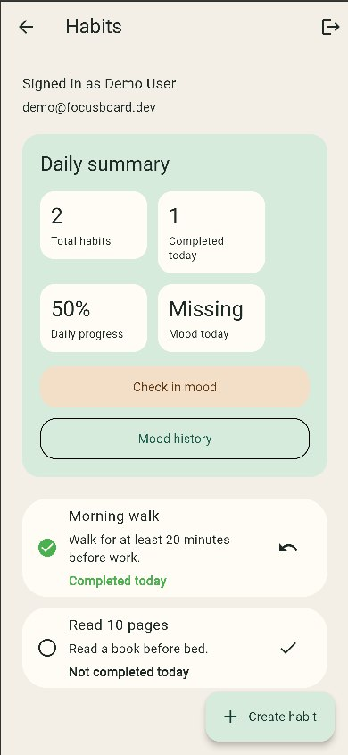

# FocusBoard

FocusBoard — учебный Flutter-проект, в котором я сфокусировался на проектировании спокойного и понятного продукта для персональной продуктивности вокруг трёх ежедневных сценариев:

- аутентификация
- трекинг привычек
- mood check-in

Проект организован в feature-first стиле с разделением на `data`, `domain` и `presentation` слои. На текущем этапе приложение опирается на локальное хранение и ручной роутинг, при этом domain API изолирован достаточно, чтобы развивать инфраструктуру поэтапно и без полного переписывания приложения.

  
  

## Что умеет приложение

- проверяет auth state при запуске через отдельный auth flow
- позволяет пользователю войти, зарегистрироваться и выйти из аккаунта
- показывает список привычек с flow создания, редактирования, просмотра деталей и удаления
- отслеживает, выполнена ли привычка сегодня
- показывает небольшой daily summary блок
- позволяет отмечать настроение и смотреть историю mood check-in
- хранит данные локально, включая совместимый с web storage

## Архитектурные заметки

В кодовой базе уже заложены и используются:

- feature-first организация
- state-driven обновление UI
- явные domain use cases
- repository abstraction
- локальные data source как источник истины
- route guards и typed route arguments

Presentation-слой сейчас построен на `ChangeNotifier`-based controllers.
Это сделано намеренно и честно отражено в коде через `*Controller`, а не через формальное naming под `Cubit`: архитектурное решение выбрано под текущий масштаб приложения и оставляет понятную точку роста для дальнейшего усложнения state management.

## Storage

Приложение использует небольшую локальную абстракцию хранения:

- file-based JSON на IO-платформах
- `localStorage` на web

Это прагматичный persistence-слой для текущего этапа разработки: он помогает проверить поведение приложения, сценарии данных и границы слоёв до подключения более тяжёлой production-oriented инфраструктуры.

## Что было изучено

Ниже — темы, вокруг которых была подготовлена почва в проекте и изучены их свойства на простых примерах, чтобы понимать, где и зачем их стоит применять дальше.

| Тема         | Статус                                           | Комментарий                                                                                                                                                                               |
| ------------ | ------------------------------------------------ | ----------------------------------------------------------------------------------------------------------------------------------------------------------------------------------------- |
| `bloc`       | изучен и подготовлен к осознанной интеграции     | В проекте уже выстроен явный controller/state design без искусственного маскирования под `Cubit`. На простых примерах были разобраны принципы event/state-подхода, поэтому миграция на настоящий `bloc`/`cubit` остаётся понятным следующим шагом. |
| `freezed`    | изучен на базовых сценариях immutable-моделей    | Текущие state-классы реализованы вручную для лучшей прозрачности. При этом заранее изучены преимущества `freezed` для union types, immutable state и генерации вспомогательного кода. |
| `auto_route` | подготовлена архитектурная база для расширения   | Навигация уже приведена к более аккуратному виду через guards и typed arguments. На простых примерах были изучены сильные стороны декларативного роутинга, поэтому дальнейшая интеграция будет естественным развитием текущей структуры. |
| `dio`        | изучен как основа будущего API-слоя              | У проекта пока нет удалённого API, поэтому сетевой слой сознательно не усложнялся заранее. При этом на простых примерах были разобраны базовые возможности `dio`: клиент, запросы, обработка ошибок и расширяемость через interceptors. |
| `hive`       | изучен как следующий кандидат для local storage  | Сейчас локальное хранение реализовано через собственный JSON storage, что позволило сначала зафиксировать доменную модель и сценарии данных. Параллельно были изучены свойства `Hive` как более удобного варианта для локальной персистентности. |
| `melos`      | изучен как инструмент масштабирования репозитория | Репозиторий пока остаётся одним Flutter-приложением, что соответствует текущему объёму задачи. На простых примерах были изучены возможности `melos` для monorepo и multi-package workflow, чтобы понимать, когда такой переход действительно оправдан. |
| `Firebase`   | изучен как возможное направление развития        | Текущая аутентификация локальная и персистентная, что позволило сначала сосредоточиться на пользовательских сценариях и архитектуре. Одновременно были изучены базовые свойства Firebase-подхода для auth и backend-интеграции на простых кейсах. |

## Что получилось потренировать на текущем этапе

На текущем этапе проект позволил отработать:

- проектирование auth flow вместо `Future.delayed` на splash
- отделение UI от use cases и repositories
- построение list/detail/create/edit flow внутри feature
- работа с daily completion state и summary-вычислениями
- добавление локального persistence слоя без ломки domain API
- поддержка приложения как на IO-таргетах, так и на web
- уборка технического долга после архитектурных рефакторингов
